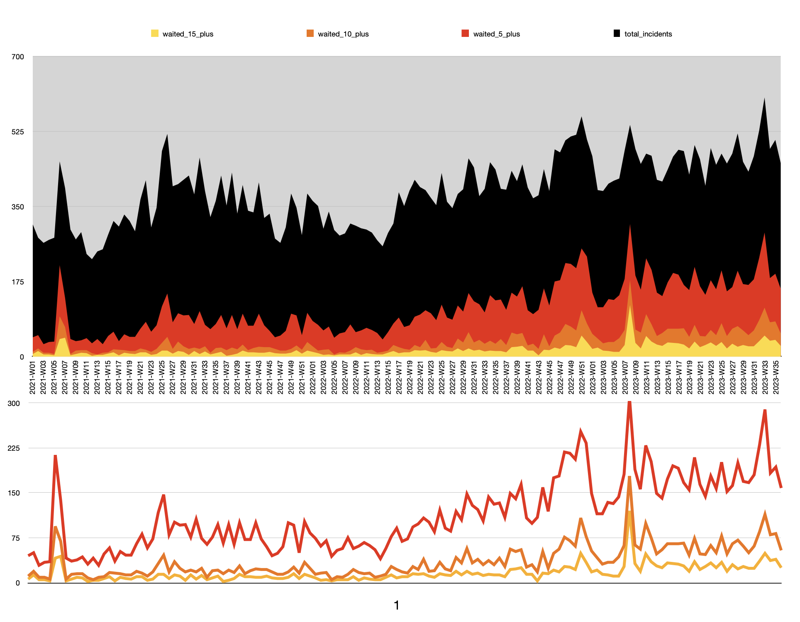

# LevelZeroAnalysis

http://drivendata.github.io/cookiecutter-data-science/#analysis-is-a-dag


## RESULTS:




# Methodology

This project processes a dataset of 911 incidents responcees and analyzes the time it takes for ("AMR" and "PF&R") to arrive at the scene. The purpose is in understanding the difference arrival times and how often such delays occur. The data is then further analyzed to understand the trends on a weekly basis and various statistics are computed to summarize the findings.

## Initialization and Loading Dataset:

- Necessary libraries (like pandas) are imported.
- A few file paths and filenames are defined to specify where your dataset is located.
- The dataset is loaded into a variable called data from the specified CSV file.
- Arrival times are extracted and converted to a datetime format.


## Merged Arrivals Analysis:

- The data is filtered to capture records corresponding to two dispatch stations: "AMR" and any station that starts with "PF&R".
- The earliest arrival time for each incident is computed for both these stations.
- These arrival times are then merged based on the incident to calculate the difference in arrival times.
- This difference (termed as wait_seconds) represents the time difference between the two stations' arrival for the same incident.
- If "AMR" arrived before or at the same time as "PF&R", the wait time is set to 0.
- This merged data is then exported to a CSV file.


## Wait Times Analysis:

- The incidents where the wait time is greater than or equal to 1 minute are filtered.
- The wait times are converted to minutes for easier interpretation.
- Additional filters are applied to identify incidents where the wait time is 5 minutes or more, 10 minutes or more, and 15 minutes or more.
- The incidents that had a wait time of 10 minutes or more are exported to a separate CSV file.

## Incidents By Week Analysis:

- The week in which each incident occurred is extracted. This is done for all the filtered datasets.
- The number of incidents that happened in each week is counted.
- A summary table is created which shows the number of incidents that had wait times of 1+ minute, 5+ minutes, 10+ minutes, and 15+ minutes in each week.
- This summary table is exported to a CSV file.

## Data Visualization and Summary:

- Various statistics, such as the total number of incidents and the average wait time, are calculated.
- A summary of the findings is printed, which includes:
- Total number of incidents.
- Average wait time.
- Number of incidents where the wait time was 5+ minutes, 10+ minutes, and 15+ minutes.

---


## 1. install
```sh
python3 -m venv venv
source venv/bin/activate
pip3 install --upgraded pip
pip3 install -r requirements.txt

chmod +x run
```

## 2. edit code (paths are hard-coded)
```sh
nano main.py
```


## 3. run
```sh
./run
```